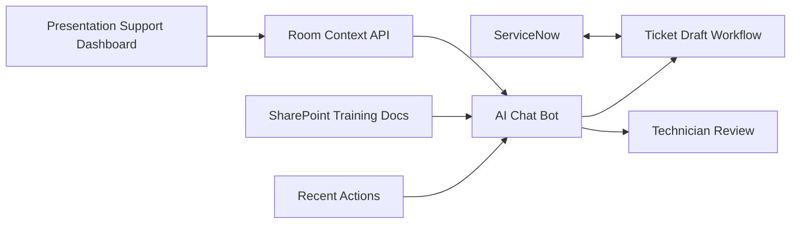

# Leadership Playbook: AI Chat Bot For Support And ServiceNow Integration

## Executive Summary

The **AI Chat Bot** is a separate project that complements the OSU Presentation Support Dashboard. The Dashboard gives technicians visual command of rooms and tools; the AI Chat Bot gives them guided troubleshooting, context-aware support, and high-quality ServiceNow ticket drafts.

The AI should feel like part of the same ecosystem. When a technician opens a room, the bot should already understand the room, current status, recent dashboard actions, schedule context, known devices, SharePoint training references, and relevant ServiceNow history.

The recommended deployment path uses local models on **DGX Spark first**, with Orion documented as a scale-up option for larger models or heavier multi-user demand.

## Value Proposition

The AI Chat Bot improves support quality without replacing human judgment.

Primary value:

- Helps student workers follow consistent troubleshooting workflows.
- Provides real-time support during calls.
- Turns room status, recent actions, and call notes into structured ServiceNow drafts.
- Reduces incomplete or inconsistent ticket documentation.
- Surfaces relevant SharePoint training materials.
- Preserves human approval for disruptive or sensitive actions.
- Creates a training layer for new technicians through guided onboarding and contextual help.

## How It Complements The Dashboard

The Dashboard remains the source of operational truth. The AI consumes approved dashboard context rather than independently scraping tools or exposing credentials.

Example technician workflow:

1. Technician opens KAd 101 in the Dashboard.
2. AI receives room status, device inventory, active class/event, recent incidents, and recent actions.
3. Technician describes the caller's issue.
4. AI guides verification steps.
5. AI recommends next actions, with power cycling treated as a last-resort step.
6. AI drafts ServiceNow documentation using Call Documentation templates.
7. Technician reviews, edits, and submits the ticket.

## Local AI Direction

Recommended baseline:

- **DGX Spark first** for local model hosting.
- Orion as a scale-up option if the team needs larger models, more concurrent users, or heavier retrieval workloads.
- Keep sensitive operational context local where practical.
- Avoid sending hardware IP data or sensitive incident details to external AI systems unless explicitly approved.

This approach aligns with cybersecurity expectations and gives OSU more control over model behavior, logs, and data flow.

## ServiceNow Ticket Draft Workflow

The bot should draft tickets, not silently submit them.

Draft fields:

- caller ONID
- building
- room
- category
- assignment group
- short description
- troubleshooting notes
- affected device
- Call Documentation template fields
- current room status snapshot
- recent dashboard actions
- relevant 25Live/Fusion schedule context
- related open incidents and five recent closed incidents

Human review is required before submission. The technician should be able to edit the draft and decide whether it becomes a ServiceNow ticket.

## Security, Compliance, And Risk Posture

Required controls:

- Use dashboard APIs as the approved data source.
- Keep service credentials out of the browser and out of prompts.
- Redact unnecessary personal data.
- Log AI usage according to approved OSU policy.
- Require human confirmation before disruptive recommendations such as power cycling.
- Keep prompt/response retention limited and policy-aligned.
- Review FERPA, cybersecurity, data classification, and ServiceNow data handling requirements.

The AI should learn from structured technician feedback, not uncontrolled self-modification. Feedback can be stored as ratings, comments, accepted/rejected recommendations, and corrected ticket drafts.

## Training And Adoption

The AI Chat Bot should support both live troubleshooting and onboarding.

Recommended training features:

- First-time user tour.
- Contextual explanations of Dashboard sections.
- Guided call-handling mode for student workers.
- Common issue workflows.
- "Why am I recommending this?" explanations.
- Feedback buttons for helpful/not helpful recommendations.
- Links to relevant SharePoint training PDFs.

This makes the tool feel supportive rather than supervisory.

## Screenshot Placeholders For Future Prototype

Add screenshots to the HTML/PDF version after the AI mock exists:

- AI assistant opened from a room.
- Guided troubleshooting flow.
- Verification-first recommendation.
- SharePoint training document suggestion.
- ServiceNow draft before technician review.
- Technician edit/review screen.
- Feedback capture after a recommendation.

## Timeline And Staffing Recommendation

| Phase | Duration | Outcome |
| --- | ---: | --- |
| 1. AI workflow design | 1-2 weeks | Define supported scenarios, ticket templates, safety rules, and required context. |
| 2. Local model baseline | 2-4 weeks | DGX Spark model serving, basic chat UI, and test prompts. |
| 3. Dashboard context integration | 2-3 weeks | AI consumes room/status/action context from Dashboard APIs. |
| 4. ServiceNow draft workflow | 2-4 weeks | Draft tickets from guided troubleshooting and templates. |
| 5. SharePoint knowledge connection | 2-4 weeks | Link or retrieve approved training materials. |
| 6. Pilot and tuning | ongoing | Improve prompts, workflows, and documentation quality from technician feedback. |

Recommended staffing:

- Product owner.
- AV support subject matter expert.
- AI/application developer.
- ServiceNow administrator.
- SharePoint/knowledge owner.
- Cybersecurity reviewer.
- Technician/student pilot group.

## Success Metrics

- More complete ServiceNow tickets.
- Less time spent writing ticket notes.
- Reduced escalation from student workers for common issues.
- Faster troubleshooting during live calls.
- Higher consistency in verification steps.
- Technician trust and voluntary usage.
- Reduced repeated mistakes in support documentation.

## Risks And Mitigations

| Risk | Mitigation |
| --- | --- |
| AI gives unsafe recommendation | Verification-first prompts, human confirmation, power cycle as last resort. |
| Sensitive data in prompts/logs | Local model hosting, redaction, retention policy, approved context API. |
| Poor ticket quality | Use templates, technician review, feedback loops, scenario testing. |
| Over-trust by student workers | Explain reasoning, require review, provide escalation guidance. |
| Hardware capacity limits | DGX Spark baseline, Orion scale-up option, monitor concurrency and latency. |
| Knowledge drift | Use approved SharePoint sources and regular content review. |

## Approval Decisions Needed

Leadership should approve:

- DGX Spark as first local model target.
- Human-reviewed ServiceNow drafts as the default workflow.
- Data retention and logging standards for AI prompts/responses.
- Initial support scenarios for pilot.
- SharePoint knowledge sources approved for AI use.
- Cybersecurity review path before production use.

## Next Steps After Playbook Approval

1. Select pilot troubleshooting scenarios.
2. Gather Call Documentation templates.
3. Confirm DGX Spark availability and model-serving approach.
4. Define Dashboard context API contract.
5. Build AI chat mock flow after Dashboard mock is approved.
6. Pilot ServiceNow ticket draft workflow with technicians and student workers.

## Open Questions

- Which local model family should be tested first on DGX Spark?
- What prompt/response retention is allowed by OSU policy?
- Which ServiceNow assignment groups and categories should be defaulted?
- Which SharePoint folders are approved for AI retrieval?
