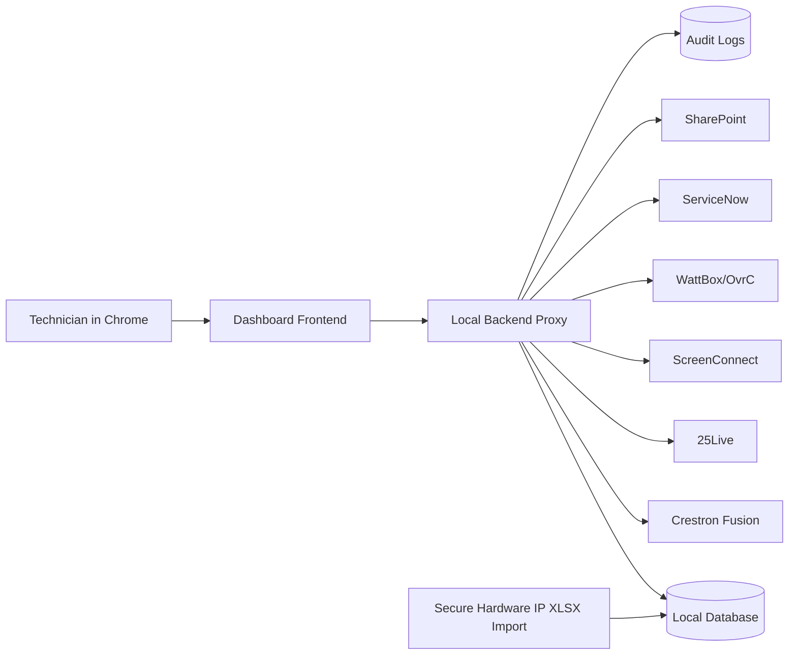

# Leadership Playbook: OSU Presentation Support Dashboard

## Executive Summary

The **OSU Presentation Support Dashboard** is the visual command center for Presentation Support technicians. It gives the team one desktop-friendly place to browse supported campuses, find buildings by acronym, open a room, and immediately see the tools and context needed to resolve classroom issues.

The first milestone is a clickable mock dashboard that can be shown to leadership and technicians before real API credentials are inserted. The mock should demonstrate campus switching, map-style building browsing, enlarged building acronyms on hover, room drill-down, status rollups, action logging, ServiceNow placeholders, and AI assistant placeholders.

The long-term goal is a secure local web app hosted on an Ubuntu Server VM. It will aggregate Crestron Fusion, 25Live, ScreenConnect, WattBox/OvrC, ServiceNow, SharePoint, and the secure Hardware IP List into a single support workflow.

## Value Proposition

This project reduces the time and mental effort required to support roughly 500 rooms across Corvallis, OSU-Cascades, and Hatfield Marine Sciences Center.

Primary value:

- Faster room lookup by campus, building acronym, building name, and room number.
- Less tool switching during live support calls.
- Clearer visibility into whether a room is offline, scheduled, occupied, or affected by an open incident.
- Safer access to sensitive hardware inventory through local import and controlled display.
- Better auditability for support actions, remote sessions, device access, and power events.
- Easier onboarding for student workers and new technicians.
- Stronger ticket documentation through future AI-assisted ServiceNow draft generation.

## What Technicians Will Experience

Technicians open one dashboard in Chrome on a Windows desktop. The first page shows a campus-aware command map with prominent building acronyms. Corvallis is the primary view, while OSU-Cascades and Hatfield are accessible from the same page through a smooth page-fold campus transition.

The intended workflow:

1. Search or visually browse by campus, building, or room.
2. Hover over a building to enlarge the acronym and show summary status.
3. Select a building to see supported rooms and current issues.
4. Open a room to view live status, schedule context, connected devices, remote access, power controls, relevant SharePoint documents, recent tickets, and the action log.
5. Use the AI assistant placeholder for guided troubleshooting and ServiceNow ticket drafting once the companion AI project is active.

The experience should feel like a support cockpit, not a generic campus map. It should be fast, legible, keyboard-accessible, and useful under pressure.

## Architecture At A Glance

Recommended baseline:

- Ubuntu Server VM.
- Local web hosting.
- HTML/JSON-oriented frontend.
- Lightweight backend proxy.
- Local database for rooms, status cache, connector health, and action logs.
- Mock connectors first, then real APIs as credentials become available.
- Microsoft Entra SSO in Phase 2 after prototype validation.

## Security, Compliance, And Risk Posture

Security is central because the dashboard exposes sensitive operational context, device links, remote access tools, and hardware IP information.

Required controls:

- Keep API credentials on the backend only.
- Never expose API keys or service credentials in browser JavaScript.
- Keep the real Hardware IP List on-prem.
- Import the real `.xlsx` locally into a normalized database or sanitized JSON cache.
- Use anonymized samples in documentation, demos, and AI-assisted planning.
- Log sensitive actions, including device UI access, XPanel launch, ScreenConnect launch, WattBox actions, ServiceNow drafts, and admin imports.
- Add Microsoft Entra SSO as a required Phase 2 item.
- Review retention, prompt logging, data classification, FERPA, and cybersecurity requirements with OSU policy owners.

Recommended audit retention for planning:

- 1 year searchable operational audit retention.
- 3 years archived retention if OSU policy allows or requires it.
- Final retention policy to be approved by cybersecurity/compliance.

## Multi-Campus Strategy

The dashboard should support all campuses from day one, even if most rooms are on the Corvallis campus.

Campuses:

- Corvallis - primary operational map.
- OSU-Cascades - same data model, smaller campus view.
- Hatfield Marine Sciences Center - same data model, campus-specific view.

The user experience should remain one page, not separate tools. A campus selector changes the main map panel with a smooth fold-over or slide transition while preserving global search, filters, and recent rooms.

## Recommended MVP Scope

The first leadership-ready mock prototype should demonstrate:

- Campus selector with Corvallis, OSU-Cascades, and Hatfield.
- Map-style building view with large acronyms.
- Hover enlargement and status summary.
- Room list and room detail view.
- Mock statuses for Fusion, display/projector power, ScreenConnect, 25Live, and ServiceNow.
- Action log panel.
- Placeholder buttons for XPanel, ScreenConnect, device web UI, WattBox, SharePoint, and AI assistant.
- Clear stale-data and connector-health indicators.
- First-run guided tour concept.

The prototype should not require real production credentials.

## Screenshot Placeholders For Future Prototype

Add screenshots to the HTML/PDF version after the clickable mock exists:

- Campus overview with Corvallis selected.
- Campus fold-over transition to OSU-Cascades or Hatfield.
- Building hover with enlarged acronym and status summary.
- Building detail panel with supported rooms.
- Room detail view with tools and live status.
- Action log panel.
- AI assistant placeholder.
- ServiceNow incident/draft placeholder.
- First-run training overlay.

## Timeline And Staffing Recommendation

Realistic phased timeline:

| Phase | Duration | Outcome |
| --- | ---: | --- |
| 1. Discovery and data shaping | 1-2 weeks | Confirm room inventory fields, campus/building list, anonymized sample, and mock data. |
| 2. Clickable leadership mock | 2-3 weeks | Demonstrable dashboard with campus map flow, room views, mock integrations, and logs. |
| 3. Backend scaffold | 2-3 weeks | Local VM backend, database, mock connector modules, secure import process. |
| 4. First real connector | 2-4 weeks | One production API connected end-to-end, likely Fusion or Hardware IP import. |
| 5. Phase 2 security | 2-4 weeks | Entra SSO, role mapping, retention policy, admin controls. |
| 6. Incremental integrations | ongoing | 25Live, ScreenConnect, WattBox/OvrC, ServiceNow, SharePoint. |

Recommended staffing:

- Project owner/product lead.
- AV systems subject matter expert.
- Backend/frontend developer or full-stack developer.
- ServiceNow administrator.
- Microsoft Entra administrator.
- Cybersecurity reviewer.
- Student/technician pilot group.

## Success Metrics

Leadership should evaluate success through:

- Reduced average time to identify the affected room and relevant systems.
- Reduced tool switching during live calls.
- Faster first response and resolution for classroom incidents.
- Improved ServiceNow documentation quality.
- Reduced escalation burden for student workers.
- Technician adoption and satisfaction.
- Fewer avoidable dispatches due to remote verification and power controls.
- Better audit traceability for sensitive support actions.

## Risks And Mitigations

| Risk | Mitigation |
| --- | --- |
| Sensitive IP/device data exposure | Local-only import, backend-only credentials, role controls, audit logs. |
| API access delays | Build mock connector scaffolding first and swap in credentials later. |
| Technicians reject the tool | Prioritize speed, search, accessibility, and pilot feedback. |
| Incorrect room/device mapping | Use Hardware IP List import validation and room-owner review. |
| Unsafe power cycling | Human confirmation, clear outlet labels, last-resort guidance, full audit trail. |
| Vendor API limitations | Support fallback links/manual launch patterns where APIs are limited. |
| Scope creep | Keep the first prototype focused on dashboard flow, mock status, and audit foundation. |

## Approval Decisions Needed

Leadership should approve:

- The neutral project direction and preferred final name.
- Use of a local Ubuntu Server VM.
- Phase 1 mock prototype before production API insertion.
- Phase 2 Microsoft Entra SSO requirement.
- Secure handling model for Hardware IP List.
- Staffing support for AV, ServiceNow, Entra, and cybersecurity review.
- Pilot group of technicians/student workers.

## Next Steps After Playbook Approval

1. Confirm final project name or continue with neutral placeholder.
2. Gather anonymized Hardware IP sample.
3. Confirm VM availability and owner.
4. Confirm the first production connector target.
5. Build the clickable leadership mock dashboard.
6. Review the mock with technicians and leadership.
7. Start backend scaffold and secure import design.

## Open Questions

- Which production connector should be first: Hardware IP import, Crestron Fusion, or ServiceNow?
- What is OSU's required audit retention for this class of tool?
- Which rooms are considered high-priority for the pilot?
- Who will approve Entra app registration and role mapping?
