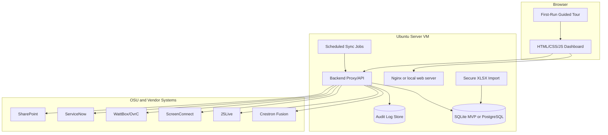
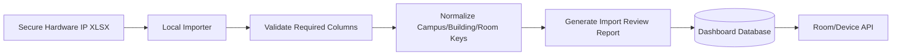
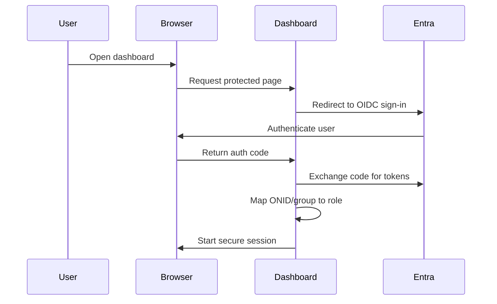

# Technical Build/Update Playbook: OSU Presentation Support Dashboard

## System Overview

The Dashboard is a desktop-first local web application for OSU Presentation Support technicians. It combines campus/building/room navigation, status summaries, device inventory, launch links, power controls, remote access, ServiceNow context, SharePoint links, and action logging.

The first implementation target is a clickable mock prototype with production-shaped data. The backend should be scaffolded so real API credentials can be inserted later without redesigning the frontend.

## Architecture



Recommended stack:

- Frontend: HTML, CSS, JavaScript, JSON-shaped API responses.
- Backend: FastAPI or Node/Fastify. Choose one and keep all connectors modular.
- Database: SQLite for prototype, PostgreSQL for production hardening.
- Web server: Nginx reverse proxy.
- Host: Ubuntu Server VM.
- Auth: local prototype mode first, Microsoft Entra OIDC in Phase 2.
- Deployment: local services first; Docker Compose optional after prototype.

## Unified Data Model

Use a stable internal model even while upstream APIs are mocked.

```json
{
  "room_id": "corvallis-kad-101",
  "campus": "Corvallis",
  "building_acronym": "KAd",
  "building_name": "Kerr Administration Building",
  "room_number": "101",
  "room_display_name": "KAd 101",
  "priority": "pilot",
  "capabilities": ["presentation", "screenconnect", "wattbox", "hybrid"],
  "status": {
    "room_online": true,
    "health_score": 92,
    "stale_data": false,
    "last_synced_at": "2026-05-30T16:35:00Z",
    "connector_health": {
      "fusion": "ok",
      "25live": "ok",
      "screenconnect": "degraded",
      "wattbox": "mock",
      "servicenow": "ok"
    },
    "fusion_processor": "online",
    "display_power": "on",
    "screenconnect_available": true,
    "active_event": {
      "source": "25Live",
      "title": "Sample Class",
      "starts_at": "2026-05-30T16:00:00Z",
      "ends_at": "2026-05-30T17:20:00Z"
    },
    "source_conflict": false
  },
  "devices": [
    {
      "device_id": "kad-101-display-1",
      "device_type": "display",
      "manufacturer": "NEC",
      "model": "Sample Model",
      "ip_or_hostname": "10.0.0.10",
      "vlan_or_zone": "AV",
      "web_ui_url": "https://device.example.local",
      "sharepoint_docs": ["https://sharepoint.example/training/display.pdf"]
    }
  ],
  "integrations": {
    "fusion_room_id": "FUSION-KAD-101",
    "xpanel_url": "https://fusion.example/xpanel/kad-101",
    "25live_location_id": "25L-KAD-101",
    "screenconnect_machine_id": "SC-KAD-101-PC",
    "wattbox": {
      "id": "WB-KAD-101",
      "outlets": [
        { "number": 3, "label": "Projector", "state": "on" }
      ]
    }
  },
  "servicenow": {
    "open_incidents": [],
    "recent_closed_incidents": []
  },
  "recent_actions": []
}
```

## Backend Connector Design

Create one connector module per integration:

- `fusion`: rooms, assets, processor status, XPanel URL, schedule cross-reference.
- `25live`: current and upcoming events by location.
- `screenconnect`: machine availability and launch URL.
- `wattbox`: outlet status and power-cycle requests.
- `servicenow`: open incidents, recent closed incidents, ticket draft handoff.
- `sharepoint`: document links and future knowledge index.
- `hardware_import`: local `.xlsx` parser and validation.

Every connector should support:

- mock mode
- credential-loaded mode
- connector health endpoint
- sync timestamp
- normalized output to the room model
- graceful failure with cached data where appropriate

## Secure Hardware IP XLSX Import

The real spreadsheet remains on-prem and is processed locally on the VM. The dashboard should not depend on opening the spreadsheet directly in the browser.

Required input columns:

- campus
- building acronym
- building name
- room number
- device type
- manufacturer
- model
- IP or hostname
- VLAN/network zone
- device web UI URL

Recommended additional local-only fields:

- Fusion room identifier
- 25Live location identifier
- ScreenConnect machine/session identifier
- WattBox identifier
- WattBox outlet number and label
- SharePoint training document URL

Import workflow:



Validation rules:

- Reject rows missing campus, building acronym, room number, device type, or IP/hostname.
- Flag duplicate device records.
- Flag unknown campuses.
- Normalize building acronyms consistently.
- Never export real IP data to public demo datasets.

## Frontend UX Requirements

Primary views:

- campus command view
- building detail panel
- room detail view
- device/tools panel
- action log panel
- AI assistant placeholder
- ServiceNow context panel
- first-run training overlay

Campus switching:

- One unified page.
- Campus selector always visible.
- Smooth fold-over or slide transition between campus views.
- Preserve global search, filters, and recently viewed rooms.

Accessibility:

- Keyboard navigation for search, campus switching, building selection, and room opening.
- Visible focus states.
- High-contrast status colors with text labels/icons.
- No status conveyed by color alone.
- Large building acronyms and readable room labels.
- Reduced-motion mode for campus transitions.

## Status And Filter Requirements

Required statuses:

- room online/offline
- Fusion processor status
- display/projector power
- ScreenConnect availability
- active class/event
- open ServiceNow incidents
- five recent closed ServiceNow incidents
- stale-data warning
- last sync time
- connector health
- room health score
- conflicting-source indicator

Required filters:

- campus
- building
- room
- active class/event
- open incident
- room offline
- device issue
- WattBox-enabled
- ScreenConnect-enabled
- hybrid/Zoom/Teams-capable
- high-priority spaces
- recently accessed
- stale data
- recently power-cycled

## Action Logging And Audit Trail

Every meaningful technician action must write an audit event.

```json
{
  "event_id": "audit-000001",
  "timestamp": "2026-05-30T16:45:00Z",
  "user_id": "tech-onid",
  "role": "technician",
  "campus": "Corvallis",
  "building_acronym": "KAd",
  "room_number": "101",
  "action_type": "xpanel_launched",
  "target": "FUSION-KAD-101",
  "outcome": "success",
  "source": "dashboard",
  "metadata": {
    "connector_mode": "mock",
    "ticket_id": null
  }
}
```

Required logged actions:

- login/logout after Entra is added
- room viewed
- IP/device details viewed
- XPanel launched
- device web UI opened
- ScreenConnect launched
- WattBox status checked
- WattBox power action requested, confirmed, succeeded, or failed
- ServiceNow ticket draft created
- ServiceNow ticket submitted or updated
- SharePoint document opened
- AI chat session started
- AI recommendation accepted, rejected, or edited
- admin import/sync/configuration changes

Retention default:

- 1 year searchable hot retention.
- 3 years archived retention if approved by OSU policy.

## Integration Notes

Crestron Fusion:

- Use backend proxy only.
- Support room status, assets, appointments, signal values, and XPanel launch URL.
- Cache frequent status reads with short TTL.

25Live:

- Query current and upcoming events by location.
- Cross-reference schedule against Fusion occupancy/status.
- Show conflicts rather than hiding them.

ScreenConnect:

- Match machines by hostname or room identifier.
- Generate or link to launch URL through backend.
- Log every remote session launch.

WattBox/OvrC:

- Prefer official/direct supported API path when available.
- Treat power cycle as high-risk.
- Require human confirmation and accurate outlet labels.
- Log request, confirmation, result, and error details.

ServiceNow:

- Display open and five recent closed incidents.
- Expose room context for AI ticket drafting.
- Do not allow silent auto-submission in the prototype.

SharePoint:

- Link relevant PDFs from room/device views.
- Preserve existing SharePoint organization.
- Later index approved content for AI retrieval.

## Microsoft Entra SSO Phase 2

Implementation path:



Required decisions:

- Entra app registration owner.
- Redirect URI.
- Allowed groups.
- Role mapping.
- Session timeout.
- Log retention for auth events.

## Deployment On Ubuntu Server

Prototype deployment:

1. Provision Ubuntu Server VM.
2. Create service account for dashboard runtime.
3. Install web server, backend runtime, and database.
4. Place frontend assets behind Nginx.
5. Run backend as a local service.
6. Store secrets in environment or approved local secret store.
7. Configure scheduled sync jobs.
8. Restrict firewall access to approved networks.
9. Enable local backups for database, configs, and logs.
10. Document restore procedure.

Optional Phase 2:

- Move app, worker, and database into Docker Compose if operations wants repeatable deployments.

## Maintenance And Recreation Guide

Maintain:

- room/device import mapping
- connector credentials
- dashboard config
- audit log retention jobs
- database backups
- OS and dependency patching
- SharePoint link index
- mock data for demos/training

Recreate from scratch:

1. Provision clean Ubuntu Server.
2. Restore application files.
3. Restore database backup or re-run Hardware IP import.
4. Restore environment/secret configuration.
5. Start backend and web server.
6. Run connector health checks.
7. Validate dashboard login and room search.
8. Confirm audit logging.

## Acceptance Test Checklist

- Load mock campus/building/room data.
- Switch campuses from one page.
- Search by building acronym, building name, and room number.
- Hover building acronym and confirm enlarged accessible display.
- Open building and room detail.
- Filter by active class/event, open incident, room offline, WattBox, ScreenConnect, stale data, and high-priority rooms.
- Show mock Fusion, 25Live, ScreenConnect, WattBox, ServiceNow, and SharePoint data.
- Import anonymized `.xlsx` into the normalized model.
- Reject invalid import rows and produce an import report.
- Log every required action.
- Show connector outage and stale-data states.
- Prepare room context for AI chat and ServiceNow draft.
- Export Markdown/HTML documentation to PDF cleanly.

## Screenshot Placeholders For Future Prototype

When the mock prototype exists, add annotated screenshots for:

- Campus overview.
- Building acronym hover state.
- Room drill-down.
- Quick filters.
- Connector health/stale-data state.
- Action log event after launching a tool.
- ServiceNow context panel.
- AI assistant placeholder.
- First-run guided tour.

## Next Steps After Playbook Approval

1. Confirm the pilot room list and anonymized Hardware IP sample.
2. Choose the first real connector target.
3. Define the exact mock data set for leadership review.
4. Confirm Ubuntu Server VM ownership and access path.
5. Build the clickable mock dashboard.
6. Build the backend scaffold with mock connector modules.
7. Review security assumptions with OSU cybersecurity before inserting production credentials.

## Open Questions

- Which connector should be real first?
- What is the approved OSU audit retention period?
- What VM resource profile will be allocated?
- Which Entra groups map to technician/admin roles?
- Which pilot rooms should be included first?
