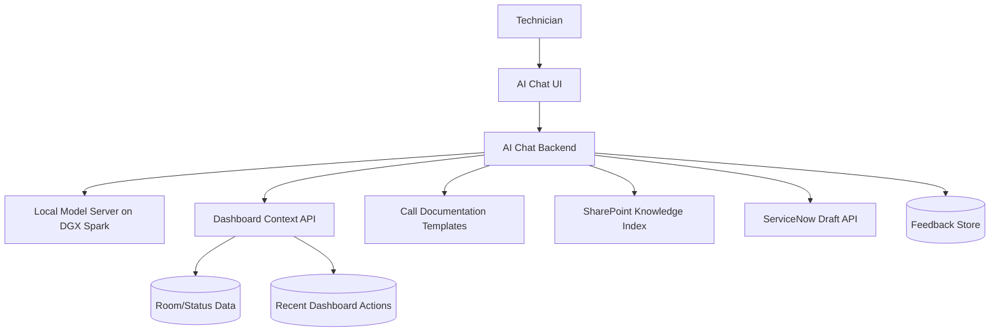
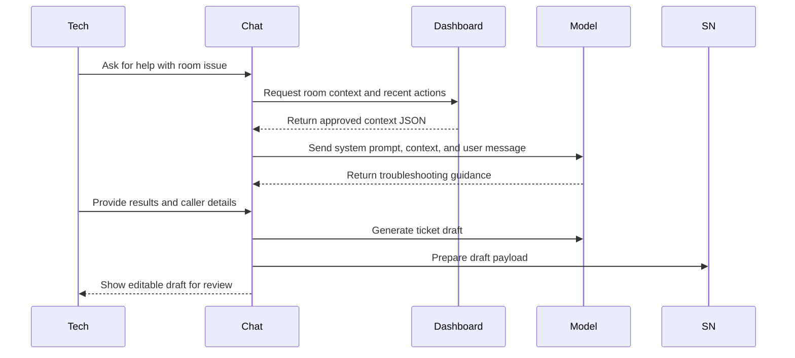

# Technical Build/Update Playbook: AI Chat Bot For Support And ServiceNow Integration

## System Overview

The AI Chat Bot is a separate local application that integrates tightly with the Dashboard. It consumes approved room context, recent actions, ServiceNow context, and SharePoint knowledge references to guide troubleshooting and draft ServiceNow ticket documentation.

The bot must not become an uncontrolled automation layer. It recommends, explains, drafts, and learns from structured feedback. Technicians remain in control.

## Architecture



Recommended baseline:

- Local model host: DGX Spark.
- Jetson AGX Orin is not the recommended primary host for this use case.
- Scale option: larger NVIDIA workstation/server-class hardware if DGX Spark cannot meet concurrency or model-size needs.
- Chat frontend: embedded Dashboard panel or separate local page with room deep-link support.
- Chat backend: local service with prompt assembly, policy checks, context retrieval, and ServiceNow draft generation.
- Retrieval: start with SharePoint links and curated templates; add vector search only after content approval.

## Data Flow



## Dashboard Context Contract

The AI should consume a purpose-built context endpoint rather than raw database access.

Example response:

```json
{
  "room": {
    "room_id": "corvallis-kad-101",
    "campus": "Corvallis",
    "building_acronym": "KAd",
    "building_name": "Kerr Administration Building",
    "room_number": "101",
    "display_name": "KAd 101"
  },
  "status": {
    "room_online": true,
    "fusion_processor": "online",
    "display_power": "on",
    "screenconnect_available": true,
    "active_event": "Sample Class until 17:20",
    "open_incidents_count": 1,
    "stale_data": false,
    "source_conflict": false
  },
  "devices": [
    {
      "device_type": "display",
      "manufacturer": "NEC",
      "model": "Sample Model",
      "safe_label": "Front Display",
      "web_ui_available": true
    }
  ],
  "recent_actions": [
    {
      "timestamp": "2026-05-30T16:40:00Z",
      "action_type": "xpanel_launched",
      "outcome": "success"
    }
  ],
  "knowledge_links": [
    {
      "title": "Display Troubleshooting Guide",
      "url": "https://sharepoint.example/display-guide.pdf"
    }
  ]
}
```

Important: do not include raw secrets. Include raw IP addresses only if approved for the current user and use case.

## Prompt And Context Strategy

System behavior:

- Act as an OSU Presentation Support assistant.
- Use the provided room context as trusted operational context.
- Ask for missing caller details when needed.
- Prefer verification steps before invasive actions.
- Treat power cycling as a last-resort recommendation.
- Require technician confirmation for disruptive steps.
- Draft ServiceNow documentation in a clear, professional format.
- Say when data is stale, missing, or conflicting.
- Provide escalation guidance when confidence is low.

Prompt layers:

1. Global system prompt.
2. OSU support policy and safety rules.
3. Current room context.
4. Relevant Call Documentation template.
5. Approved SharePoint knowledge snippets or links.
6. Conversation history.
7. Technician's latest message.

## ServiceNow Draft Workflow

The bot creates editable ticket drafts by default.

Draft schema:

```json
{
  "caller_onid": "student-or-staff-onid",
  "building": "KAd",
  "room": "101",
  "category": "Classroom Technology",
  "assignment_group": "Presentation Support",
  "short_description": "KAd 101 display not showing instructor PC",
  "affected_device": "Front Display",
  "troubleshooting_notes": [
    "Confirmed room and caller location.",
    "Checked Dashboard status: Fusion online, display power on.",
    "Opened XPanel and verified selected source.",
    "Guided caller through cable/source verification."
  ],
  "template_fields": {
    "symptom": "Display not showing expected source",
    "steps_completed": "Verification steps completed with caller",
    "resolution_or_next_step": "Escalate if issue persists after local verification"
  },
  "dashboard_snapshot": {
    "room_online": true,
    "fusion_processor": "online",
    "display_power": "on",
    "active_event": "Sample Class"
  },
  "recent_dashboard_actions": []
}
```

Submission rules:

- Technician must review and submit.
- Bot may suggest field values.
- Bot should highlight uncertainty or missing information.
- Every draft creation and submission/update event should be audited.

## Knowledge And SharePoint Strategy

Phase 1:

- Link to organized SharePoint PDFs from the Dashboard and AI responses.
- Use title, category, device type, campus/building/room metadata.

Phase 2:

- Create an approved knowledge index.
- Add retrieval over approved training documents.
- Store document source links with every answer.
- Re-index on a schedule or when SharePoint owners publish updates.

Phase 3:

- Add analytics for common unresolved questions and missing documentation.

## Safety And Feedback

Power cycling policy:

- Recommend only after verification steps.
- Identify the affected device and outlet label.
- Ask technician to confirm.
- Record recommendation, confirmation, outcome, and technician feedback.

Feedback model:

```json
{
  "feedback_id": "fb-000001",
  "timestamp": "2026-05-30T17:00:00Z",
  "user_id": "tech-onid",
  "room_id": "corvallis-kad-101",
  "recommendation_id": "rec-000010",
  "rating": "helpful",
  "accepted": true,
  "edited_ticket_draft": true,
  "comment": "Good steps, but assignment group needed correction."
}
```

The system may use feedback for reporting and prompt improvement. It should not automatically retrain or modify model behavior without review.

## Local Model Deployment And Hardware Recommendation

DGX Spark baseline:

- Host model server on trusted local network.
- Restrict access to Chat API service.
- Monitor latency, throughput, GPU memory, and error rates.
- Start with one approved model and a small pilot group.
- Keep fallback behavior for model unavailability.

Jetson AGX Orin correction:

- The earlier "Orion" reference should be read as **NVIDIA Jetson AGX Orin**.
- Jetson AGX Orin should not be the primary AI Chat Bot host.
- Orin is strong for embedded edge AI, robotics, cameras, sensors, and constrained local inference.
- This project needs a local assistant host with stronger LLM memory headroom, retrieval capacity, and service-style deployment characteristics.

DGX Spark vs Jetson AGX Orin:

| Criterion | DGX Spark | Jetson AGX Orin | Recommendation |
| --- | --- | --- | --- |
| NVIDIA positioning | Compact desktop AI computer for AI development, deployment, fine-tuning, and inference. | Edge AI platform for robotics, autonomous machines, and computer vision. | Use DGX Spark. |
| Memory | 128 GB LPDDR5x unified memory. | 32 GB or 64 GB LPDDR5. | DGX Spark has the practical LLM headroom. |
| AI performance | Up to 1 PFLOP FP4 / 1,000 TOPS-class AI compute. | Up to 275 TOPS INT8. | DGX Spark is better aligned to LLM serving. |
| Model fit | NVIDIA states support for AI models up to 200B parameters. | Best for optimized edge inference and sensor workloads. | Use Orin only for future edge appliances. |
| Deployment fit | Local AI service host for chat, RAG, and ticket drafting. | Embedded device requiring Jetson-specific deployment. | DGX Spark first. |

Sources:

- NVIDIA DGX Spark specifications: https://www.nvidia.com/en-us/products/workstations/dgx-spark/
- NVIDIA DGX Spark hardware overview: https://docs.nvidia.com/dgx/dgx-spark/hardware.html
- NVIDIA Jetson AGX Orin product page: https://www.nvidia.com/en-us/autonomous-machines/embedded-systems/jetson-orin/
- NVIDIA Jetson AGX Orin Series Technical Brief: https://www.nvidia.com/content/dam/en-zz/Solutions/gtcf21/jetson-orin/nvidia-jetson-agx-orin-technical-brief.pdf

Scale-up option:

- If DGX Spark cannot meet latency/concurrency needs, evaluate a larger NVIDIA workstation/server platform.
- Do not treat Jetson AGX Orin as the next step up from DGX Spark for this dashboard assistant.

Operational requirements:

- Define model update process.
- Keep model configuration versioned.
- Record prompt template version with each AI session.
- Monitor quality and safety metrics.

## Security And Compliance

Required controls:

- Use approved Dashboard context APIs.
- Do not expose ServiceNow or SharePoint credentials to the browser.
- Redact unnecessary personal data before prompt assembly.
- Restrict raw IP/device data to authorized users.
- Define prompt/response retention before production use.
- Keep AI logs searchable only by authorized admins.
- Follow OSU cybersecurity, privacy, FERPA, and data classification policies.

Audit events:

- AI chat session started.
- Room context requested.
- Knowledge document referenced.
- Recommendation generated.
- Recommendation accepted/rejected.
- Ticket draft generated.
- Ticket draft edited.
- Ticket submitted or abandoned.
- Feedback submitted.

## Build Phases

1. Define support scenarios and safety rules.
2. Collect Call Documentation templates.
3. Stand up local model service on DGX Spark.
4. Build chat backend with mock room context.
5. Connect Dashboard context endpoint.
6. Add ServiceNow draft schema and editable review UI.
7. Add SharePoint knowledge links.
8. Add feedback capture.
9. Pilot with student workers and technicians.
10. Review logs, improve prompts, and expand scenarios.

## Acceptance Test Checklist

- Start chat from a room context.
- Bot identifies stale or missing room data.
- Bot asks for missing caller ONID when needed.
- Bot recommends verification steps before power cycling.
- Bot requires human confirmation before disruptive steps.
- Bot drafts ServiceNow ticket fields from conversation and context.
- Technician can edit draft before submission.
- Bot references approved SharePoint resources.
- Feedback is stored as structured data.
- Prompt template version is logged.
- Local model outage produces graceful fallback message.
- Sensitive credentials are never included in prompts or browser responses.

## Screenshot Placeholders For Future Prototype

When the AI mock exists, add annotated screenshots for:

- Chat panel embedded in the Dashboard.
- Room context summary shown to technician.
- Guided call documentation flow.
- ServiceNow draft generation.
- Required human review before ticket submission.
- AI feedback controls.
- Model outage fallback message.

## Next Steps After Playbook Approval

1. Gather Call Documentation templates.
2. Select initial pilot troubleshooting scenarios.
3. Confirm DGX Spark access and local model-serving requirements.
4. Define the Dashboard context endpoint contract.
5. Build the AI chat mock flow with static room context.
6. Add ServiceNow draft payload mapping.
7. Review prompt retention, redaction, and AI audit requirements with OSU cybersecurity.

## Open Questions

- Which local model family should be approved first?
- What is the final prompt/response retention policy?
- Which ServiceNow categories and assignment groups are approved defaults?
- Which SharePoint folders are approved for AI indexing?
- What concurrency target should DGX Spark support for the pilot?
